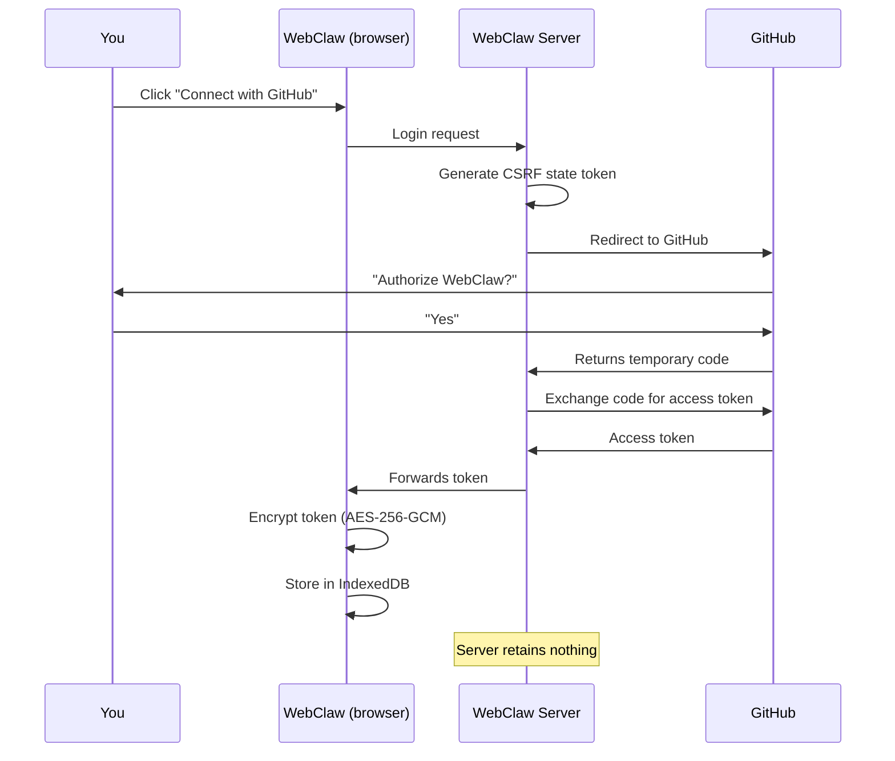

# Authentication & security

How sign-in works in WebClaw, and why it's secure.

## Signing in

1. Go to [webclaw.nakamacyber.ai](https://webclaw.nakamacyber.ai)
2. Click **Connect with GitHub**
3. GitHub asks you to authorize the app — accept
4. You're redirected back, signed in

That's it. No signup form, no password to create, no verification email.

## What happens behind the scenes

WebClaw uses **GitHub OAuth** to authenticate you:

### Why this is secure

**The server stores nothing.** The WebClaw server does one job: exchange the temporary GitHub code for an access token. The token is immediately sent to your browser. The server doesn't keep it, doesn't log it, never touches it again.

**Your token is encrypted.** As soon as it reaches your browser, the token is encrypted with AES-256-GCM (the same standard used by banks) via your browser's native WebCrypto API. It's stored in IndexedDB — never in plain text in localStorage, sessionStorage, or cookies.

**CSRF protection.** A random state code is generated for each login attempt. If someone tries to hijack the auth flow, the code won't match and the login is rejected.

**Your files don't pass through the server.** All GitHub API calls (read files, save, list folders) are made directly from your browser. The WebClaw server never sees the content of your documents.

## Permissions requested

WebClaw requests access to your **repositories**. This is needed to:
- Read and write files in your vault repo
- List your repos during initial setup
- Create commits when you save files

WebClaw does **not** request access to your emails, organizations, or personal data beyond repos.

## Signing out

1. Click your **avatar** in the top right
2. Click **Disconnect**

Signing out deletes the encrypted token and encryption key from your browser. Your files remain intact in your GitHub repo.

## Revoking access

To completely remove the authorization:

1. Go to [github.com/settings/applications](https://github.com/settings/applications)
2. Find **WebClaw** in the list
3. Click **Revoke**

After revoking, WebClaw can no longer access your repos.

## Summary

| Question | Answer |
|----------|--------|
| Is my token stored on a server? | **No** — encrypted in your browser only |
| Do my files pass through a server? | **No** — direct browser ↔ GitHub communication |
| What if I switch browsers? | Sign in again with GitHub. Your files are on GitHub. |
| What if WebClaw goes down? | Your documents are in your own repo. They're yours. |

---

**Next** → [Connect your AI](./03-connect-your-ai.md)
