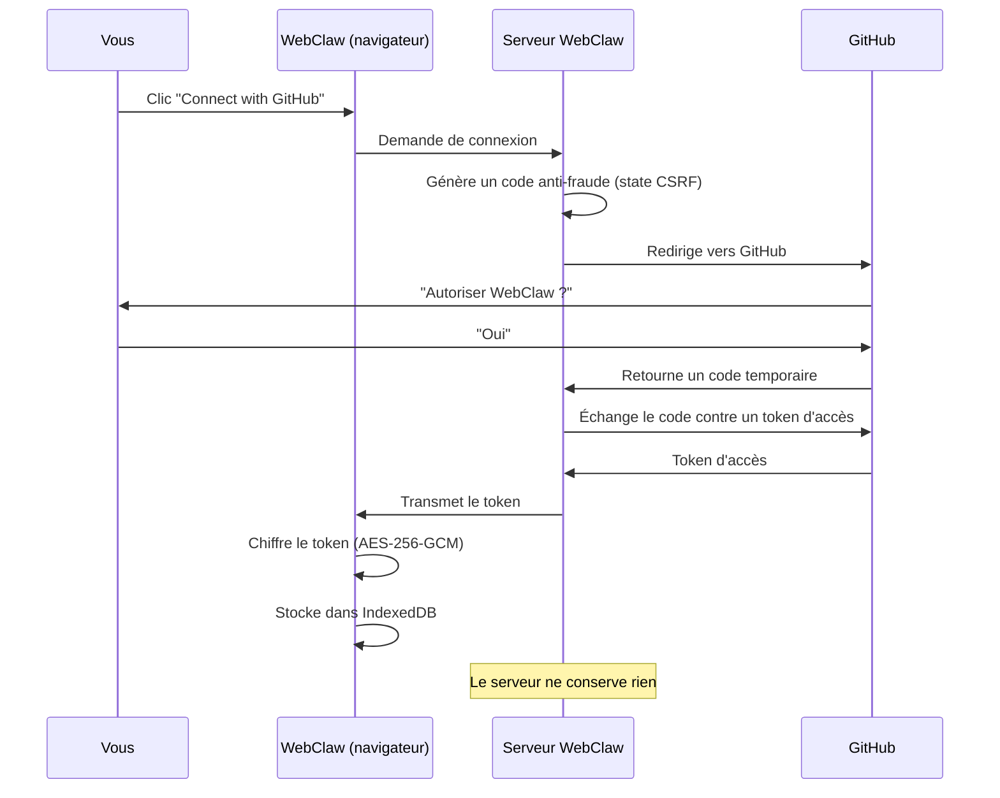

# Connexion & authentification

Comment fonctionne la connexion dans WebClaw, et pourquoi c'est sécurisé.

## Se connecter

1. Ouvrez WebClaw dans votre navigateur
2. Cliquez **Connect with GitHub** sur la page d'accueil
3. GitHub vous demande d'autoriser l'application — acceptez
4. Vous êtes redirigé vers WebClaw, connecté

C'est tout. Pas de formulaire d'inscription, pas de mot de passe à créer, pas d'email de vérification.

## Ce qui se passe en coulisses

WebClaw utilise **GitHub OAuth** pour vous authentifier. Voici le flux complet :

### Ce qui rend ça sécurisé

**Le serveur ne stocke rien.** Le serveur WebClaw ne fait qu'un seul travail : échanger le code temporaire GitHub contre un token d'accès. Le token est immédiatement transmis à votre navigateur. Le serveur ne le conserve pas, ne le logge pas, ne le touche plus jamais.

**Votre token est chiffré.** Dès qu'il arrive dans votre navigateur, le token est chiffré avec AES-256-GCM (le même standard utilisé par les banques) via l'API WebCrypto native de votre navigateur. Il est stocké dans IndexedDB — jamais en clair dans localStorage, sessionStorage, ou les cookies.

**Protection anti-fraude.** Un code aléatoire (state CSRF) est généré à chaque connexion. Si quelqu'un essaie de détourner le flux d'authentification, le code ne correspondra pas et la connexion sera rejetée.

**Vos fichiers ne passent pas par le serveur.** Tous les appels à l'API GitHub (lire un fichier, sauvegarder, lister les dossiers) sont faits directement depuis votre navigateur. Le serveur WebClaw ne voit jamais le contenu de vos documents.

## Permissions demandées

WebClaw demande l'accès à vos **dépôts** GitHub. C'est nécessaire pour :
- Lire et écrire des fichiers dans le dépôt de votre vault
- Lister vos dépôts pour la configuration initiale
- Créer des commits quand vous sauvegardez des fichiers

WebClaw ne demande **aucun** accès à vos emails, organisations, ou données personnelles au-delà des dépôts.

## Se déconnecter

1. Cliquez sur votre **avatar** en haut à droite
2. Cliquez **Disconnect**

La déconnexion supprime le token chiffré et la clé de chiffrement de votre navigateur. Vos fichiers restent intacts dans votre dépôt GitHub.

## Révoquer l'accès

Si vous souhaitez supprimer complètement l'autorisation :

1. Allez dans [github.com/settings/applications](https://github.com/settings/applications)
2. Trouvez **WebClaw** dans la liste
3. Cliquez **Revoke**

Après révocation, WebClaw ne pourra plus accéder à vos dépôts.

## Résumé

| Question | Réponse |
|----------|---------|
| Mon token est-il stocké sur un serveur ? | **Non** — chiffré dans votre navigateur uniquement |
| Mes fichiers passent-ils par un serveur ? | **Non** — communication directe navigateur ↔ GitHub |
| Que se passe-t-il si je change de navigateur ? | Reconnectez-vous avec GitHub. Vos fichiers sont sur GitHub. |
| Que se passe-t-il si WebClaw disparaît ? | Vos documents sont dans votre propre repo. Ils sont à vous. |

---

**Prochaine étape** : [Connecter son IA (BYOK)](./03-connecter-son-ia.md)
